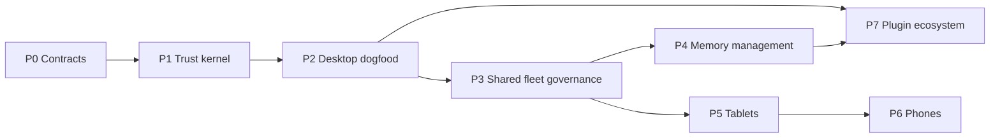

# OpenAB Studio Roadmap

- **Status:** Living delivery plan
- **Last updated:** 2026-08-07
- **Architecture:** [System architecture](./docs/architecture.md)
- **Platform tiers:** [Platform support and release tiers](./docs/adr/platform-support-tiers.md)
- **Execution model:** [Workstreams](./docs/workstreams.md)
- **Tracker rules:** [Project management](./docs/project-management.md)

This roadmap orders accepted capabilities; it does not promise dates. Every phase must produce a
usable vertical slice, evidence for every claimed platform, and independently reviewable tasks.

## Current OpenAB instance baseline

Baseline rechecked against OpenAB `main` commit `3ace7de3` on 2026-08-07. The latest local release tag
is `v0.10.0-beta.2`; reverse MCP-over-ACP exists on `main` and should not be assumed available in that
release without a later tagged build.

| Capability | Current state | Planning effect |
|---|---|---|
| Authenticated `GET /acp` WebSocket | Available | Studio ACP vertical slice can start |
| `initialize`, new, prompt, resume | Available | Resume continues context but does not replay history |
| Cancel | Partial downstream semantics | UI must not claim the agent stopped |
| Reverse MCP-over-ACP | On current `main` | Suitable for gated low-risk capability experiments |
| Fine-grained permission relay | Not available | General native tools remain blocked on grant design |
| Fleet Management API/controller | Not available as the Studio contract | W2 must design and implement the management plane |
| Multi-user fleet identity/RBAC | Not available | Shared fleets remain gated by P3 |
| Durable cross-device history | Not available | Do not claim transcript synchronization |

This table records a dependency baseline, not ownership: OpenAB instance changes remain in the OpenAB
repository, while Studio consumes versioned capabilities. Recheck it at every phase boundary.

## Delivery sequence

P4 and P5 may run in parallel after P3 stabilizes. P7 starts with internal distribution during P2
and expands to a public ecosystem only after permissions, compatibility, and recovery are proven.

## P0 — Contracts and foundation

**Goal:** freeze enough vocabulary and seams for parallel implementation without freezing product
learning.

Scope:

- Accept the client, plugin, and fleet architecture ADRs.
- Define versioned schemas for fleet identity, instance descriptors, principals, resources, grants,
  memory references, plugin manifests, capabilities, and audit events.
- Bootstrap the Rust core, TypeScript UI, generated bindings, Tauri shells, and contract tests.
- Run build spikes for macOS, Windows, Linux, iOS/iPadOS, and Android before choosing release tiers.
- Define threat model, secret storage boundary, migration policy, and telemetry redaction.

Exit criteria:

- The `echo` plugin manifest can be validated without running the plugin.
- One fixture drives both Rust and TypeScript schema compatibility tests.
- CI produces development artifacts or a documented blocker for every target family.
- No feature work depends on an undefined identity, placement, permission, or state owner.

## P1 — Trust kernel and plugin-host vertical slice

**Goal:** build the smallest trustworthy Studio core, then exercise it through the public plugin
surface.

Scope:

- Rust `studio-core` for storage, migrations, profiles, fleet registry, transport, grants, secrets,
  plugin lifecycle, audit, and capability negotiation.
- TypeScript UI for fleet navigation, connection health, and explicit error states.
- ACP-over-WebSocket connection and one complete session turn against an existing OpenAB instance.
- Plugin install, validate, enable, disable, upgrade, rollback, and uninstall state machine.
- Sandboxed or remote `echo` plugin with one scoped tool and redacted audit events.

Exit criteria:

- A clean install can register an existing instance, create a session, reconnect, and resume.
- An unauthorized plugin call is denied by the core, not only hidden by the UI.
- Plugin failure cannot corrupt the registry or prevent Studio from starting in safe mode.
- Credentials and secret values are absent from logs, exports, and plugin-visible configuration.

## P2 — Personal multi-fleet desktop dogfood

**Goal:** make Studio useful every day on macOS, Windows, and Linux for a single operator managing
multiple fleets and existing instances.

Scope:

- Fleet and instance switcher, health, agents, sessions, resources, grants, and plugin inventory.
- OS credential stores, deep links, notifications, update channels, diagnostics, and recovery.
- `studio-dev` plugin using only the public SDK for read-only repository, pull request, and CI data.
- Desktop local plugin placement for reviewed `mcp-stdio` providers.
- Installer, signing, update, rollback, and uninstall evidence per operating system.

Exit criteria:

- The team uses Studio for its own Studio/OpenAB work through the dogfood plugin.
- Each desktop OS passes install, connect, update, rollback, credential, suspend/resume, and removal
  checks on documented architectures.
- Switching fleets cannot leak sessions, resources, grants, memory, or secrets across boundaries.

## P3 — Shared fleet governance and durable state

**Goal:** support teams and cross-device management without treating an ACP bearer as identity.

Scope:

- Fleet Management API and event stream for instances, agents, resources, grants, plugins, memory
  metadata, and audit history.
- Hybrid controller topology: an embedded management endpoint for simple deployments and a dedicated
  fleet controller for multi-instance fleets.
- User/device identity, short-lived credentials, revocation, ownership, and optional federation.
- Fleet Owner/Admin/Member/Viewer roles plus resource-scoped grants.
- Durable revision IDs, optimistic concurrency, idempotent mutations, and offline conflict handling.

Exit criteria:

- Two users and two devices see consistent fleet state and cannot cross each other's grants.
- Revocation takes effect within a documented bound for management and ACP session authority.
- Every high-impact mutation has an attributable, redacted audit event.
- Controller loss and reconnect have tested recovery behavior without silent last-write-wins loss.

## P4 — Memory management

**Goal:** let users inspect and govern memory without requiring Studio to own every memory backend.

Scope:

- Memory provider SPI and reference model with personal, fleet, and workspace scopes.
- Provenance, visibility, retention, deletion, export, and provider health.
- Agent-to-memory grants using the same principal/resource/grant kernel.
- Search and management UI with clear source-of-truth and synchronization status.
- First reference provider implemented through the public Plugin SDK.

Exit criteria:

- A user can explain where each memory item lives, who may access it, and how deletion propagates.
- Provider outage or partial deletion is visible and recoverable.
- Studio caches do not masquerade as authoritative provider state.

## P5 — Tablet full-management release

**Goal:** bring complete fleet management to iPadOS and Android tablets with touch-native layouts.

Scope:

- Adaptive navigation and dense management views for touch and keyboard/trackpad use.
- Secure credential storage, device enrollment, deep links, background reconnect, and notifications.
- Full remote/instance plugin management and ACP sessions.
- Device capability negotiation that hides only execution placements unavailable on the device.

Exit criteria:

- All management mutations available on desktop are available on tablets or explicitly documented as
  an operating-system restriction with a remote alternative.
- iPadOS and Android tablet test matrices cover install, upgrade, offline recovery, and revocation.

## P6 — Phone full-management release

**Goal:** preserve complete management capability in workflows designed for small screens and
intermittent foreground time.

Scope:

- Task-focused phone navigation, safe bulk actions, approval flows, and incident triage.
- Push-assisted event awareness and background lifecycle recovery.
- Full fleet, grants, memory, plugin, and session management through remote execution placements.
- Accessibility, one-handed use, interrupted mutation, and low-bandwidth testing.

Exit criteria:

- Every management capability has a usable phone flow, not merely a scaled desktop screen.
- Interrupted or duplicated mobile requests are idempotent and expose their final state.
- iOS and Android phone release evidence is maintained independently.

## P7 — Public plugin ecosystem and provisioning

**Goal:** let third parties safely extend Studio and automate fleet operations.

Scope:

- Signed packages, publisher identity, private fleet catalogs, and optional public registry.
- Compatibility resolution, staged rollout, rollback, quarantine, and vulnerability response.
- Resource, memory, workflow, and later UI extension points.
- Provisioning plugins for installing or operating OpenAB instances without coupling providers to the
  Studio kernel.
- WASM/WASI runtime only where its host-call and permission model is proven across target devices.

Exit criteria:

- An external author can build, test, package, install, upgrade, and remove a plugin using published
  documentation and tooling only.
- Registry compromise, malicious update, abandoned plugin, and runtime crash have documented recovery
  paths.

## Explicitly paused or deferred

- Browser-hosted Web App distribution is paused.
- Studio-managed local OpenAB installation is deferred to provisioning plugins.
- UI plugins are deferred until tool/resource/memory extension contracts are stable.
- Billing, marketplace economics, and fleet hosting are not part of the initial product boundary.

## Progress gates

A phase advances because its exit criteria are proven, not because its issue count reaches a
percentage. Live status belongs in GitHub Issues and the Project board. Architecture changes update
an ADR; temporary blockers and delivery sequencing stay in the tracker.
