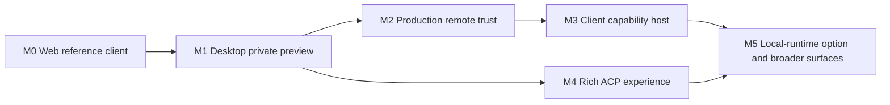

# OpenAB Studio Roadmap

- **Status:** Living delivery plan
- **Last updated:** 2026-08-07
- **Product brief:** [OpenAB Studio](./README.md)
- **Architecture proposal:** [Remote-first client ADR](./docs/adr/remote-first-client.md)

This document converts the OpenAB Studio direction into independently shippable milestones. Unlike the
architecture ADR, this file is expected to change as protocol support and product evidence change.
Dates, owners, and issue links should be added only after maintainers commit to them.

## Current server baseline

Baseline inspected at OpenAB `main` commit `3ace7de3` and rechecked on 2026-08-07:

The base ACP chat surface is included in `openab-0.10.0-beta.2`. Reverse MCP-over-ACP is present on
`main` through `3ace7de3` but is not part of that OpenAB release; M3 must depend on a later release or
an explicitly pinned development build.

| Server capability | Current state | App implication |
|---|---|---|
| `/acp` WebSocket + transport auth | Available | Reference client can connect now |
| `initialize` and capability negotiation | Available | Feature-gate from negotiated capabilities |
| `session/new`, `session/prompt` | Available | Basic chat can ship |
| `session/resume` | Available, no history replay | Client owns transcript |
| `session/cancel` | Partial; backend may continue | UI says client wait cancelled, not agent stopped |
| Progressive message streaming | Not available | Render one terminal text chunk correctly first |
| Structured tool-call updates | Not available | Do not parse tool chips from decorated text |
| Reverse MCP-over-ACP | Available | Capability-host work can begin behind a gate |
| Permission relay | Not available; current tool approval is automatic | Do not expose general high-risk native tools |
| Hosted per-user ACP identity | Not available | Remote preview is private/single-user only |
| `session/load` / server transcript | Not available | No cross-device history claim |

The baseline must be refreshed before starting a milestone that depends on server behavior.

## Milestone overview

M2 is the gate for public remote distribution. M3 and M4 may be developed in parallel after M1,
but high-risk capabilities cannot be enabled for users before the M2 identity boundary and a
permission/grant contract exist.

## M0 — Web reference client

### Goal

Prove the OpenAB ACP client contract in the least privileged environment before desktop packaging.

### Scope

- TypeScript JSON-RPC and ACP client state machine.
- Connection form for a development or private endpoint.
- Browser WebSocket auth using `openab.bearer.<token>, acp.v1`.
- `initialize`, capability capture, `session/new`, `session/prompt`, and `session/cancel`.
- Local transcript with explicit export and clear controls.
- Reconnect with bounded backoff and `session/resume`.
- Redacted protocol diagnostics.
- Markdown rendering with untrusted HTML disabled or sanitized.

### Exit criteria

- A browser test drives a real OpenAB deployment through one complete turn.
- Disconnect/reconnect resumes context without duplicating the transcript.
- Wrong credentials, unsupported protocol, timeout, and oversized/closed socket cases are visible and
  actionable.
- Cancelling a turn uses wording that acknowledges backend work may continue.
- No bearer or full `sessionId` appears in logs or exported diagnostics.

### Explicitly deferred

- Account sign-in and hosted multi-user identity.
- Native filesystem, terminal, clipboard, or browser control.
- Structured tool cards fabricated from text.
- Cross-device transcript sync.

## M1 — Tauri desktop private preview

### Goal

Package the reference client for macOS, Windows, and Linux without changing the ACP behavior.

### Scope

- Tauri 2 shell loading the shared app UI.
- Typed `HostBridge` with a restrictive browser implementation.
- Connection profiles and OS credential storage.
- App data directory for transcripts and non-secret settings.
- Deep links, external URL opening, native notifications, and lifecycle handling.
- Single-instance behavior and safe window restoration.
- Signing, notarization where applicable, installer artifacts, and a
  [signed update strategy](https://v2.tauri.app/plugin/updater/).
- OS/architecture build matrix decided from supported distribution targets.

### Exit criteria

- The same ACP client conformance tests pass in browser and desktop transports.
- Signed or development-signed artifacts install and launch on current supported macOS, Windows, and
  Linux test machines.
- Credentials survive restart but are absent from config, transcript, crash, and diagnostic files.
- The app connects equally to loopback and private remote OpenAB profiles.
- Removing a profile removes its stored credential after an explicit confirmation.

### Distribution boundary

M1 is a local/private preview. A shared bearer may be used only for a deployment whose users already
share that trust boundary. It is not a public hosted-client release.

## M2 — Production remote trust

### Goal

Replace bearer possession as user identity before public remote use.

### Server prerequisites

- User-authenticated control-plane session.
- Short-lived ACP connection ticket or equivalent credential.
- Ticket audience bound to one OpenAB deployment and intended client.
- User and client identity propagated to the gateway trust boundary.
- Session/capability ownership, revocation, and audit.
- Rate, connection, and resource limits suitable for untrusted clients.

### Client scope

- Sign-in and sign-out.
- Device/session inventory and revocation.
- Automatic ticket refresh without writing long-lived secrets into WebSocket URLs or logs.
- Clear separation between endpoint trust, account identity, and conversation state.
- Recovery for expired or revoked credentials without losing the local transcript.

### Exit criteria

- Two users on the same service cannot resume or invoke capabilities for each other's session.
- Revoking a device prevents new connections and terminates or expires existing authority within the
  documented bound.
- Audit records identify user, client, deployment, ACP session, and capability provider without
  exposing bearer or resume credentials.
- Threat-model review covers browser origins, desktop deep links, credential theft, replay, and a
  compromised client-provided MCP server.

## M3 — Client capability host

### Goal

Let the agent use narrowly granted client-side capabilities over MCP-over-ACP.

### Order of work

1. Implement the capability-host framework with no providers enabled.
2. Add session-scoped grants, provider status, timeout, cancellation, and redacted audit events.
3. Prove multi-provider declaration, reconnect, withdrawal-on-resume, and disconnect behavior.
4. Add one narrowly scoped, low-risk reference provider.
5. Add browser, file, or terminal providers only through separate reviewed contracts.

### Server prerequisites

- A permission/grant model whose result reaches the client and is not silently auto-approved for
  providers that require interactive consent.
- Session and client identity from M2 for hosted use.
- Structured errors and reliable provider disconnect behavior.

### Exit criteria

- A provider cannot be discovered or called outside its owning session and client grant.
- Reconnect re-declares the complete provider set; omitted providers are withdrawn.
- A timed-out or cancelled tool releases local resources and late results are ignored.
- Provider arguments, results, screenshots, and diagnostics obey explicit size limits.
- Locking or quitting the app revokes or disconnects active client providers.

## M4 — Rich ACP experience

### Goal

Improve fidelity after the basic client contract is stable.

### Candidate server/client slices

- Progressive `agent_message_chunk` delivery.
- Structured `tool_call` and `tool_call_update` events.
- `agent_thought_chunk`, plan, usage, and available-command updates where supported.
- Backend-propagating cancellation and an honest `agent stopped` terminal state.
- Image, audio, and resource content blocks.
- Session close/list/delete and config/mode controls.
- `session/load` plus a replayable server transcript, if OpenAB chooses to own that state.

Each slice should be negotiated by capability and independently releasable. The client must retain a
fallback for older OpenAB versions instead of using server version strings as feature switches.

### Exit criteria

- Structured events never need to be reverse-parsed from rendered answer text.
- Streaming reconnect and duplicate-event behavior are covered by protocol tests.
- A capability absent from negotiation hides or disables its UI action with an explanation.

## M5 — Optional local runtime and broader surfaces

### Candidate work

- Desktop-managed local OpenAB installation, startup, health, repair, and upgrades.
- Explicit choice between connecting to an existing local instance and starting a managed one.
- Multi-agent rooms as client orchestration over independent ACP sessions.
- Mobile shell after touch and background-lifecycle requirements are defined.
- Cross-device transcript sync after identity, encryption, conflict, retention, and deletion semantics
  are accepted.
- WASM components where they remove duplicated protocol logic or provide measured client-side value.

Bundling the OpenAB runtime is not an automatic desktop requirement. Before accepting it, compare
artifact size, agent CLI installation/auth, child-process sandboxing, upgrades, crash recovery, and
support cost against the remote-first model.

## Proposed implementation slices

Create issues from these slices rather than one umbrella "build OpenAB Studio" issue:

| Slice | Depends on | Suggested proof |
|---|---|---|
| ACP TypeScript wire types and JSON-RPC dispatcher | Current `/acp` contract | Recorded fixture + live conformance |
| Connection/reconnect state machine | ACP client | Deterministic fake-clock tests + real socket test |
| Transcript store contract | App core | Browser and desktop adapter contract tests |
| Reference conversation UI | App core | Interaction and accessibility tests |
| Tauri `HostBridge` | M0 | Browser no-op and desktop command allowlist tests |
| Credential store | Tauri shell | Restart/removal tests on all target OSes |
| Packaging/release pipeline | Tauri shell | Install, launch, update, rollback evidence |
| Remote identity ADR | Control plane decision | Cross-user isolation and revocation tests |
| Capability-host ADR | M2 + permission design | Threat model and one low-risk provider E2E |
| Structured ACP event slices | Server support | Capability negotiation + old-server fallback |

## Known risks to track

- ACP and MCP evolve independently; pin generated types and refresh against upstream deliberately.
- Browser and native WebSocket implementations may differ in auth, proxy, TLS, and suspend/resume
  behavior.
- A locally correct transcript may diverge from agent context after server expiry or partial failure.
- Desktop auto-update, signing, and credential behavior are three OS-specific products, not one CI
  checkbox.
- Reverse MCP turns the client into a tool authority; a compromised app or extension is inside the
  user's granted capability boundary.
- Local runtime bundling can quietly make the desktop shell responsible for agent credentials,
  subprocess sandboxing, storage migration, and recovery.

## Planning hygiene

- Keep stable decisions in the ADR and temporary sequencing in this file.
- Replace roadmap entries with issue/PR links when work starts; do not use completed prose as a
  substitute for live tracker state.
- Refresh the server capability table at every milestone boundary.
- Record platform support only after install and runtime verification on that OS/architecture.
- Treat Web, macOS, Windows, and Linux as separate release evidence even when they share source.
