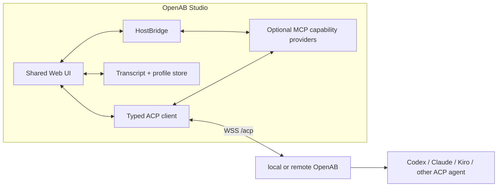

# ADR: OpenAB Studio as a Remote-First ACP Client

- **Status:** Proposed
- **Date:** 2026-08-07
- **Author:** @canyugs
- **Related:** [ACP Server over WebSocket — Base](https://github.com/openabdev/openab/blob/main/docs/adr/acp-server-websocket-base.md),
  [Reverse MCP-over-ACP](https://github.com/openabdev/openab/blob/main/docs/adr/acp-server-websocket-reverse-mcp.md),
  [MCP-over-ACP tunnel contract](https://github.com/openabdev/openab/blob/main/docs/mcp-over-acp-tunnel-contract.md)
- **Product brief:** [OpenAB Studio](../../README.md)
- **Delivery plan:** [OpenAB Studio roadmap](../../ROADMAP.md)

---

## 1. Context

OpenAB already separates messaging surfaces from the agent runtime. ACP over WebSocket extends that
boundary to browser, desktop, IDE, CLI, and other standard clients. OpenAB Studio should consume
that boundary rather than introduce a second application-specific gateway or move the Rust core into
every client.

The app must support three deployment shapes without forking its architecture:

1. a web app connecting to remote OpenAB;
2. a desktop app connecting to local or remote OpenAB; and
3. a future desktop-managed local OpenAB process, if product evidence justifies it.

The server's current constraints affect the client design:

- `session/resume` restores downstream context but does not replay history;
- text replies arrive as one terminal `agent_message_chunk`, not progressive deltas;
- tool activity is currently merged into text rather than emitted as structured tool events;
- `session/cancel` ends the client waiter but does not necessarily stop downstream work;
- network authentication is a transport bearer, not a multi-user identity system; and
- reverse MCP works, while fine-grained permission relay is deferred and tools are auto-approved.

## 2. Decision

Build OpenAB Studio as a **remote-first Web application with a thin desktop host**, maintained in a
repository separate from the OpenAB server.

- Implement the ACP client, connection manager, transcript model, and UI in TypeScript.
- Keep OpenAB server transport, identity, and permission changes in `openabdev/openab`; keep Studio
  product, UI, packaging, and client release work in this repository.
- Ship the web surface directly and package the same UI in a Tauri 2 desktop shell.
- Put native integrations behind a typed `HostBridge`; browser builds use a restricted/no-op
  implementation and desktop builds use explicit Tauri commands.
- Connect to OpenAB exclusively through the documented ACP-over-WebSocket contract for session work.
- Use reverse MCP-over-ACP for optional client-provided tools; do not add a bespoke tool tunnel.
- Do not bundle or start OpenAB core in the first desktop release. A managed local runtime is a
  later, separately accepted decision.
- Do not require WebAssembly for the initial client. WASM may later share generated Rust protocol
  validation or CPU-heavy local functionality, but it must not become a hidden copy of OpenAB core.

### Logical architecture



The WebSocket carries both normal ACP session traffic and, when declared, MCP-over-ACP traffic.
The desktop host never talks directly to a downstream coding CLI.

## 3. Client package boundaries

The initial implementation should preserve these boundaries even if all packages begin in one
repository:

```text
apps/
├── web/                  # browser entrypoint and deployment
└── desktop/              # Tauri shell, signing, updater, host commands
packages/
├── acp-client/           # JSON-RPC, negotiation, reconnect, sessions, cancellation
├── app-core/             # conversations, transcript, profiles, feature gates
├── app-ui/               # shared presentation components
└── capability-host/      # MCP-over-ACP providers and grant enforcement
```

`acp-client` must not import UI or Tauri code. `app-core` depends on an abstract profile store,
transcript store, and `HostBridge`. `capability-host` is not loaded in the first milestone.

The paths above are a target boundary, not authorization to create every package before it has a
consumer.

## 4. Connection and session model

### Connection profiles

A profile contains non-secret metadata such as display name, endpoint, and server fingerprint or
deployment identifier. Its bearer credential is stored separately.

- Remote profiles require `wss://` outside explicit development mode.
- The browser client presents the bearer through the supported `Sec-WebSocket-Protocol` form.
- A desktop-native WebSocket may use an `Authorization` header if the selected implementation
  supports it consistently; otherwise it uses the same subprotocol flow as the web app.
- Secrets, complete WebSocket frames, and `sessionId` values are redacted from normal logs.

### Session state

For each conversation, the app stores:

- the owning connection profile;
- the server-minted ACP `sessionId` as sensitive session state;
- the client transcript and rendering metadata;
- connection and turn status; and
- the capability declarations that must be re-declared on resume.

On reconnect the app performs `initialize`, then `session/resume`. Resume success means the client
may continue the downstream context; it does not mean that the server supplied or verified the
display transcript. The app never merges transcripts merely because two profiles have matching raw
IDs.

An expired downstream session may restart fresh and announce that in its next response. The UI must
surface that transition instead of presenting the old transcript as proof that the agent still has
the old context.

### Turn state

The UI state machine distinguishes at least:

```text
disconnected -> connecting -> ready -> submitting -> waiting -> completed
                                      \-> cancelling -> client-cancelled
                                      \-> failed
```

`client-cancelled` must not be labelled as "agent stopped" until backend cancellation propagation
exists. Reconnect uses bounded exponential backoff and stops retrying on an authentication or
protocol-negotiation failure that requires user action.

## 5. Transcript ownership

The app owns the display transcript until OpenAB advertises and implements `session/load` with
history replay. This means:

- the browser reference client may start with local browser storage;
- the desktop app uses an app-scoped data store with restrictive filesystem permissions;
- clearing a local transcript does not delete agent-side context;
- deleting an app conversation cannot claim to delete a server session until a corresponding server
  method exists; and
- sync across devices requires a separately designed service and identity model.

Sensitive values are excluded from diagnostic export. Incognito or non-persistent conversations are
an allowed later client feature because transcript persistence is already a client concern.

## 6. Native host and capability boundary

The first desktop release uses the host only for application integration:

- OS credential storage;
- notifications and badges;
- deep links and external URL opening;
- app lifecycle and update integration; and
- a private app-data directory.

File, terminal, clipboard, browser-control, and other agent-callable host functions are a later
capability-host milestone. Each provider must define:

1. its user-visible purpose and risk;
2. a session-scoped or narrower grant;
3. an argument and result size boundary;
4. cancellation and timeout behavior;
5. audit events with secret redaction; and
6. behavior when the provider disconnects or the app is locked.

The client declares an enabled provider as a `type:acp` MCP server and follows the existing
MCP-over-ACP tunnel contract. General file or terminal access must not ship while OpenAB silently
auto-approves all relevant permission requests. Low-risk, tightly pinned providers may be proposed
individually with an explicit threat model.

## 7. Authentication and trust

The existing shared `OPENAB_ACP_AUTH_KEY` is sufficient for local development and a private,
single-user deployment. It is not the production identity model for a hosted app.

Before public multi-user remote use, OpenAB needs a trust layer that provides:

- a user-authenticated control-plane session;
- a short-lived, audience-bound ACP connection ticket or equivalent credential;
- binding between user, deployment, ACP session, and admitted client capability providers;
- revocation and connection/session audit; and
- an authorization decision that reaches the existing gateway trust boundary without relying on
  the fixed synthetic `acp_client` identity.

This ADR does not choose the control-plane protocol. It fixes the requirement that transport
possession alone must not become the hosted product's user identity.

## 8. Why Tauri, and alternatives

### [Tauri 2](https://v2.tauri.app/start/) — chosen for the first desktop shell

Tauri fits a thin, remote-first shell: the UI remains a normal web application, native capabilities
can be exposed through a small allowlisted command surface, and OpenAB already has Rust expertise.
The decision accepts platform WebView differences and the need for OS-specific packaging,
[signing, and distribution](https://v2.tauri.app/distribute/) tests.

### Electron — valid fallback, not selected initially

KiroCrew demonstrates the operational maturity of an Electron shell, including bundled backend
supervision, signing, update channels, and browser integration. Electron is preferable if OpenAB Studio
later needs Chromium-identical rendering, extensive browser-window control, or a bundled local core
whose process management dominates shell size. Those are not first-release requirements.

### Browser-only PWA — supported surface, insufficient desktop host

A PWA is useful for the reference client and remote access, but it cannot provide a general native
credential and capability boundary across all target operating systems.

### Flutter or separate native apps — rejected for now

They would duplicate the web UI or require a second presentation implementation before the product
contract is proven.

### OpenAB core compiled to WASM — rejected as the app architecture

OpenAB's agent subprocess, filesystem, credential, and networking responsibilities do not map to a
portable browser sandbox. WASM remains a component option, not the runtime boundary.

## 9. Consequences

### Positive

- Web and desktop validate the same protocol and product model.
- Remote OpenAB remains first-class instead of becoming a fallback to a bundled runtime.
- Native privilege is isolated behind a small host boundary.
- The server and app can evolve independently through ACP capability negotiation.
- A later local-runtime manager can be added without rewriting the ACP client or UI.

### Costs and risks

- The app must own transcript persistence and explain resume semantics accurately.
- Tauri/WebView behavior must be tested on all three desktop operating systems.
- The current shared bearer limits initial remote distribution to private/single-user deployments.
- Rich tool activity and permissions cannot be represented faithfully until server work lands.
- Supporting both browser and native WebSocket stacks can create subtle authentication and lifecycle
  differences; the shared conformance suite must exercise both.

## 10. Non-goals

- Replacing Discord, Slack, LINE, or other OpenAB adapters.
- Embedding the OpenAB Rust core or an agent CLI in the first desktop build.
- Cross-platform session handoff between an ACP session and a messaging-platform session.
- Server-side multi-agent fan-out.
- A general native file or terminal tool before grants and permission handling exist.
- Selecting a cloud account, billing, or organization administration model.

## 11. Acceptance criteria for accepting this ADR

- A browser reference client proves the current ACP chat subset against a real OpenAB deployment.
- The same `acp-client` package runs in the Tauri shell without protocol forks.
- A reconnect test proves `initialize` plus `session/resume` while preserving the client transcript.
- The UI represents cancellation and session-expiry semantics without overstating server behavior.
- Desktop credentials are stored outside application config and transcript storage.
- The implementation has an explicit local/private-only gate until production remote identity is
  designed and accepted.
- Native capability hosting remains disabled until its grant and audit contract is accepted.

## 12. Follow-up decisions

Separate ADRs are required before:

- bundling or supervising a local OpenAB runtime;
- introducing hosted multi-user ACP identity and connection tickets;
- enabling a general native capability host;
- adding cross-device transcript synchronization; or
- revisiting Electron because a Chromium-specific or bundled-runtime requirement has emerged.
