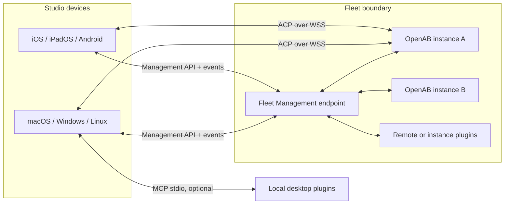

# OpenAB Studio System Architecture

- **Status:** Proposed
- **Last updated:** 2026-08-07
- **Client ADR:** [Cross-platform remote-first client](./adr/remote-first-client.md)
- **Plugin ADR:** [Plugin platform](./adr/plugin-platform.md)

## Product boundary

OpenAB Studio is the management and interaction surface for fleets of OpenAB instances. It is not
the agent runtime and is not required to run on the same machine as an instance. It connects to
existing instances first; lifecycle provisioning is a later plugin capability.

### Core terms

| Term | Meaning |
|---|---|
| Fleet | A management boundary sharing identity, policy, resource namespace, and audit history |
| OpenAB instance | One deployed OpenAB runtime reachable through advertised capabilities |
| Agent | An agent endpoint exposed by an instance |
| Principal | A user, device, agent, plugin, service account, or role that may receive authority |
| Resource | A typed object with a stable identity, owner, fleet, attributes, and supported actions |
| Grant | A revocable authorization for a principal to perform actions on a scoped resource set |
| Memory | Provider-backed information governed as resources, including provenance and retention |
| Plugin | A signed or locally trusted package contributing tools, resources, memory, workflows, or UI |

### Fleet ownership invariant

An OpenAB instance belongs to **at most one owning Fleet at a time**. It may be temporarily
unassigned only while it is being enrolled or moved. This invariant was accepted in
[issue #2](https://github.com/canyugs/openab-studio/issues/2).

Studio can manage and display many Fleets at once, but a cross-Fleet view aggregates separate
authorization contexts. It does not create simultaneous Fleet membership or erase the underlying
policy boundary.

Moving an instance between Fleets is an explicit audited operation that must:

1. preflight identity, resource, and provider conflicts;
2. revoke authority issued by the source Fleet;
3. invalidate Fleet-scoped caches and session bindings;
4. issue destination-Fleet authority before activating the instance there; and
5. report resource/provider migration outcomes separately from the ownership change.

Fleet-owned resources, grants, memory, and audit records are not silently copied during a move.
Each resource or provider defines whether its data remains in the source Fleet, can be migrated, or
must be recreated.

Simultaneous multi-Fleet ownership was rejected for the initial contract because overlapping policy,
revocation, cache keys, audit attribution, and offline reconciliation would become ambiguous. A
future Fleet federation contract may allow explicitly delegated cross-Fleet access without changing
the single-owner invariant.

## Logical system



### Management plane

The Fleet Management API owns durable inventory and policy operations:

- fleets, instances, agents, users, devices, and service principals;
- resources, roles, grants, secrets references, and audit events;
- plugin installation, placement, configuration, rollout, and health;
- memory metadata, provider state, retention, and deletion jobs; and
- revisioned mutations, idempotency, event cursors, and synchronization.

Simple personal deployments may embed this endpoint in one OpenAB instance. Multi-instance or shared
fleets may run a dedicated fleet controller. Both must implement the same versioned contract; Studio
must not infer semantics from which topology is used.

### Interactive plane

ACP-over-WebSocket owns live agent interaction:

- initialize and capability negotiation;
- session create, resume, prompt, cancel, and future event streaming; and
- reverse MCP-over-ACP where an explicitly granted client capability is appropriate.

ACP does not become the inventory database, fleet authorization API, memory catalog, or plugin
registry. An ACP session receives already evaluated identity and grants from the management/trust
boundary.

### Plugin plane

MCP is the preferred tool and data protocol. The Studio Plugin Spec adds the pieces MCP does not
define: package identity, compatibility, runtime placement, lifecycle, permissions, secrets, resource
types, migrations, audit, and distribution.

## Studio client architecture

The proposed implementation uses a Rust trusted core, TypeScript presentation, and Tauri 2 device
shells.

```text
apps/
├── desktop/                 # Tauri desktop shell and OS integration
└── mobile/                  # Tauri mobile entrypoints and lifecycle adapters
crates/
├── studio-core/             # orchestration, policy, storage, sync, transport
├── studio-protocol/         # versioned management/ACP/plugin types
├── studio-plugin-host/      # lifecycle, placement, sandbox, grants, audit
└── studio-storage/          # local database, encryption metadata, migrations
packages/
├── app-ui/                  # adaptive TypeScript UI
├── app-state/               # presentation and ephemeral interaction state
├── plugin-sdk/              # public author API and generated types
└── test-contracts/          # fixtures and cross-language conformance
plugins/
├── echo/                    # minimal reference plugin
└── studio-dev/              # dogfood integration
```

Paths are target boundaries, not a requirement to create empty packages. The Rust core owns every
security decision. TypeScript may request an operation and render its result but may not independently
grant authority, unwrap secrets, or mark an unaudited mutation successful.

## Trusted kernel versus plugins

The kernel owns the invariants that cannot be replaced safely at runtime:

- identity and device binding;
- fleet/instance registry and protocol negotiation;
- ACP, management, and MCP transport mediation;
- resource identity, role evaluation, scoped grants, and revocation;
- secret broker and platform credential-store integration;
- plugin validation, lifecycle, placement, sandbox, and safe mode;
- audit event production and redaction;
- local database, encryption metadata, and migrations; and
- update compatibility and recovery.

Features that should prove the public Plugin SDK include provider integrations, resource types,
memory backends, provisioning drivers, CI/repository tools, workflows, and later UI contributions.

## Resource and grant model

RBAC supplies understandable fleet-level defaults; grants supply least-privilege exceptions and
delegation.

```text
principal -- grant(actions, conditions) --> resource selector --> resource
```

A resource has `id`, `type`, `fleetId`, provider/owner, attributes, supported actions, and revision.
A grant has principal, actions, resource selector, optional conditions, issuer, expiry, and revocation
state. Conditions may include session, device, time, network, approval, or maximum result size.

Suggested built-in roles are Fleet Owner, Fleet Admin, Fleet Member, and Fleet Viewer. Roles do not
bypass resource grants, secret policy, or plugin placement restrictions. Agent authority is evaluated
like any other principal and must not inherit the logged-in user's complete access implicitly.

## Memory model

Studio manages memory without assuming it stores the authoritative content. A memory provider may
run in an OpenAB instance, a fleet service, or an external system. The management plane records a
stable reference, scope, provenance, visibility, retention, provider revision, and synchronization
status.

Initial scopes are personal, fleet, and workspace. Memory access uses the same resource/grant kernel.
Deletion is a tracked provider operation with a terminal result; removing a Studio cache entry is not
reported as deleting provider data.

## State ownership

| State | Source of truth | Device copy |
|---|---|---|
| Fleet identity, membership, grants, audit | Fleet Management endpoint | Revisioned cache |
| Instance and agent runtime health | OpenAB instance/controller observation | Ephemeral cache |
| ACP session context | OpenAB instance/agent runtime | Session reference and display state |
| Cross-device conversation history | Future fleet history service | Offline cache |
| Plugin installation and policy | Fleet endpoint or local desktop host by placement | Reconciled view |
| Memory content | Declared memory provider | Optional redacted/index cache |
| Device-only UI preferences | Device | Local store |
| Secrets | OS/fleet secret broker | Opaque handle where possible |

Every mutation carries an idempotency key and expected revision when applicable. The UI distinguishes
pending, accepted, reconciled, conflicted, and failed states instead of presenting an optimistic local
write as durable truth.

## Platform and placement matrix

| Capability | Desktop | Tablet/phone | Notes |
|---|---:|---:|---|
| Fleet and instance management | Yes | Yes | Full management parity |
| ACP-over-WebSocket sessions | Yes | Yes | Background behavior is platform-specific |
| Remote/instance MCP plugin | Yes | Yes | Preferred cross-platform placement |
| Local `mcp-stdio` executable | Yes | No | Arbitrary child processes are not a mobile assumption |
| Native device provider | Reviewed | Reviewed | Narrow host APIs and explicit grants only |
| WASM/WASI plugin | Later | Later | Depends on portable host-call and sandbox proof |
| Plugin install/configure/disable | Yes | Yes | Mobile can manage placements it cannot execute locally |

Device capability negotiation reports execution placements and host APIs. It must never be confused
with the user's authorization: “this device cannot execute it” and “this user may not use it” are
different states.

## Security invariants

- Credentials and secret values never enter transcripts, diagnostics, plugin config, or audit bodies.
- Plugins receive capability handles, not ambient filesystem, network, environment, or user authority.
- Fleet and resource identity are included in cache keys, session bindings, and audit attribution.
- High-impact mutations are authorized in the trusted core and revalidated at the authoritative
  endpoint.
- Plugin disable, revocation, device loss, and fleet removal have bounded enforcement behavior.
- Safe mode can start without third-party plugins and can roll back a failed schema/plugin update.
- Compatibility is negotiated by capabilities and schema ranges, not guessed from display versions.

## Dogfooding rule

The `echo` plugin proves packaging and lifecycle with minimal domain risk. The `studio-dev` plugin is
the first meaningful dogfood consumer and must use only public SDKs, documented grants, and supported
runtime placements. Any private hook required by it is evidence that the kernel or Plugin Spec is
missing a general contract.

## Open decisions

- Exact Fleet Management API encoding and event transport.
- Whether the first personal fleet endpoint is embedded in OpenAB or shipped as a separate controller.
- Local database and encrypted-cache implementation.
- Cross-device conversation-history ownership and retention.
- Plugin package signing, publisher identity, and registry governance.
- Minimum OS versions, CPU architectures, release tiers, and mobile background guarantees.

These decisions require focused ADRs or spikes before their dependent milestone begins.
