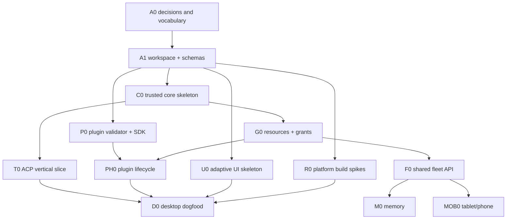

# OpenAB Studio Workstreams and Task Decomposition

- **Status:** Proposed execution plan
- **Last updated:** 2026-08-07
- **Roadmap:** [Milestone roadmap](../ROADMAP.md)
- **Tracking:** [Project management](./project-management.md)

## Sizing contract

Sizes measure one focused contributor after dependencies and acceptance criteria are ready:

| Size | Expected scope | Worktree rule |
|---|---|---|
| S | Up to one focused day; one narrow behavior or document | Preferred agent task |
| M | Two to three focused days; one vertical seam | Good independent worktree |
| L | Up to one focused week; several related changes | Requires checkpoints and review contract |
| XL | Larger, cross-cutting, or uncertain | Must be split or begin as a spike |

Size is not elapsed calendar time and does not include waiting on another repository, signing
accounts, stores, or maintainer decisions. One task produces one logical PR. If acceptance requires
unrelated packages or more than one independently useful proof, split it.

## Workstreams

| ID | Workstream | Owns | Does not own |
|---|---|---|---|
| W0 | Architecture and governance | ADRs, schemas, threat model, tracker/review rules | Product implementation |
| W1 | Trusted Studio core | Registry, storage, sync, transport, grants, secrets, audit | Feature-specific integrations |
| W2 | Fleet/OpenAB contracts | Management API, controller topology, ACP capability requirements | Studio presentation |
| W3 | Product UI and UX | Adaptive navigation, management flows, session UI, accessibility | Authorization decisions |
| W4 | Plugin platform | Manifest, SDK, host, lifecycle, reference plugins | Kernel identity policy |
| W5 | Memory | Memory SPI, governance, provider and UI | Generic resource/grant kernel |
| W6 | Platform and release | Tauri shells, OS integration, signing, stores, updater | Product semantics |
| W7 | Dogfood and quality | E2E, conformance, diagnostics, release evidence | Owning production modules by default |

Each workstream has a maintainer owner even if individual tasks are delegated. The owner guards its
contracts, reviews cross-workstream changes, and reports blockers; ownership does not mean doing every
task personally.

## Suggested team shapes

| Active implementers | Recommended allocation | Trade-off |
|---:|---|---|
| 1 | W0/W1 first, then one vertical slice through W3/W4/W7 | Lowest coordination cost; platform spikes and UI wait |
| 2–3 | Core/contracts; UI/platform; plugin/quality | Best initial shape after the root workspace lands |
| 4–6 | W1 core, W2 contracts, W3 UI, W4 plugins, W6 platform, W7 integration; W0 held by maintainer | Maximum useful P0/P1 parallelism before chokepoints dominate |
| 7+ | Add per-OS release and later memory/fleet subteams only after contracts stabilize | More people do not help while schema and policy decisions are unresolved |

For agent-assisted work, one human maintainer should own architecture and merge order. Delegate
well-bounded S/M implementation, tests, fixtures, documentation, and platform spikes. Keep security
policy, schema acceptance, migrations, and release authority with an explicitly accountable reviewer.

## Dependency shape

The root workspace, generated schema output, database migrations, dependency lockfiles, and release
configuration are integration chokepoints. They should have one active owner at a time.

## P0 issue-ready backlog

IDs below are planning identifiers, not GitHub issue numbers.

| ID | Size | Workstream | Task | Depends on | Proof |
|---|---:|---|---|---|---|
| A-01 | S | W0 | Accept vocabulary and instance-to-fleet invariant ADR | — | ADR review records open decisions |
| A-02 | M | W0/W2 | Fleet Management API and controller-topology ADR | A-01 | request/event examples and failure semantics |
| A-03 | M | W0/W1 | Threat model for device, fleet, ACP, plugin, and secret boundaries | A-01 | abuse cases mapped to controls/tests |
| A-04 | S | W0 | Versioning and compatibility policy | A-01 | supported/unsupported fixture table |
| B-01 | M | W1/W3/W6 | Bootstrap Rust/TypeScript/Tauri workspace | A-01 | desktop and mobile dev shells compile |
| B-02 | M | W1 | Define shared schema source and generated bindings | A-04, B-01 | Rust/TS round-trip fixtures |
| B-03 | S | W7 | Establish CI, formatting, lint, unit, and contract-test gates | B-01 | required checks run on sample failure |
| B-04 | S | W0/W7 | Add issue/PR templates and Review Contract | A-01 | dry-run issue and PR satisfy templates |
| R-01 | M | W6 | macOS/Windows/Linux packaging spike | B-01 | install/launch evidence and blockers |
| R-02 | M | W6 | iOS/iPadOS Tauri lifecycle spike | B-01 | device/simulator build and background notes |
| R-03 | M | W6 | Android phone/tablet Tauri lifecycle spike | B-01 | device/emulator build and background notes |
| R-04 | S | W6/W0 | Propose minimum OS/architecture release tiers | R-01..03 | decision based on measured evidence |

`B-01` is deliberately serialized because every later worktree would otherwise edit the same root
manifests. After it lands, `A-02`, `A-03`, `B-02`, `B-03`, `B-04`, and the three platform spikes can
run largely in parallel.

## P1 issue-ready backlog

| ID | Size | Workstream | Task | Depends on | Proof |
|---|---:|---|---|---|---|
| C-01 | M | W1 | `studio-core` command/event boundary and error model | B-02 | UI cannot bypass core operation path |
| C-02 | M | W1 | Local database and forward-only migration harness | B-02 | fresh, upgrade, failed migration recovery tests |
| C-03 | M | W1/W6 | Secret broker abstraction plus first OS adapter | A-03, C-01 | opaque handles and redaction tests |
| C-04 | M | W1 | Fleet/instance profile registry and capability cache | C-02 | cross-fleet isolation tests |
| C-05 | M | W1/W2 | ACP-over-WebSocket client state machine | C-01, B-02 | fixture and live OpenAB conformance |
| C-06 | S | W1/W3 | Honest session, resume, cancel, and failure model | C-05 | state-machine tests and UI copy fixtures |
| G-01 | M | W1 | Principal/resource/grant evaluator | A-03, B-02 | allow, deny, expiry, revocation tests |
| G-02 | M | W1 | Audit event schema, sink, and redaction | G-01, C-02 | attributable high-impact mutation tests |
| P-01 | M | W4 | Plugin manifest schema, validator, and fixtures | B-02 | valid/invalid compatibility corpus |
| P-02 | M | W4/W1 | Plugin lifecycle state machine and safe mode | P-01, C-02, G-01 | install/rollback/quarantine recovery tests |
| P-03 | M | W4 | Public SDK and local test host | P-01, G-01 | external sample builds without private APIs |
| P-04 | S | W4/W7 | `echo` reference plugin | P-02, P-03, G-02 | install-to-call-to-audit E2E |
| U-01 | M | W3 | Adaptive app shell and fleet navigation | C-01, B-01 | desktop/tablet/phone viewport tests |
| U-02 | M | W3 | Connection and ACP session UI | C-04..06, U-01 | real instance complete-turn E2E |
| U-03 | M | W3 | Resources, grants, plugins, and audit management UI | G-01..02, P-02, U-01 | keyboard/touch/a11y flows |

Parallel lanes after schemas land:

- core lane: `C-01 -> C-02/C-04/C-05`;
- security lane: `G-01 -> G-02`, then `C-03`;
- plugin lane: `P-01 -> P-03`, then integrate with `P-02`;
- UI lane: `U-01`, then mock-contract views while core work proceeds;
- quality lane: fixtures and E2E harnesses alongside each accepted contract.

`P-02` and `U-03` are integration tasks and should start only when their dependency PRs are merged,
not by copying unreviewed work between worktrees.

## P2 issue-ready backlog

| ID | Size | Workstream | Task | Depends on | Proof |
|---|---:|---|---|---|---|
| D-01 | M | W3/W1 | Multi-fleet switcher and reconciled health view | C-04, U-01 | no cross-fleet cached data leakage |
| D-02 | M | W4 | `studio-dev` read-only dogfood plugin | P-03..04 | daily use with public SDK only |
| D-03 | M | W4/W6 | Desktop `mcp-stdio` placement host | P-02, C-03 | process/env/grant/cancel isolation tests |
| D-04 | L | W6 | Desktop credential, lifecycle, deep-link, and updater integration | R-01, C-03 | per-OS install/update/rollback matrix |
| D-05 | M | W7 | Desktop diagnostics and support bundle | G-02, D-04 | secrets absent from adversarial fixture |
| D-06 | L | W6/W7 | Signed desktop release pipeline | D-04..05 | verified artifacts for each release tier |

Split D-04 and D-06 by operating system once shared scaffolding lands. The common release contract is
one task; platform implementations can then use separate worktrees and reviewers.

## Later epics

Later work should remain epic-sized until the preceding contract is accepted:

| Epic | Phase | First split |
|---|---|---|
| FLEET | P3 | API schema; identity/device binding; revision/event sync; RBAC; audit; embedded controller; dedicated controller |
| MEMORY | P4 | provider SPI; resource/grant mapping; provenance/retention; deletion jobs; first provider; management UI |
| TABLET | P5 | adaptive UX; iPadOS lifecycle; Android tablet lifecycle; remote plugin management; release evidence |
| PHONE | P6 | small-screen IA; interrupted mutations; push/events; iOS release; Android release; accessibility |
| ECOSYSTEM | P7 | package signing; private catalogs; registry; publisher verification; WASM spike; UI extensions; provisioning |

Create issue-ready S/M tasks only after the epic's prerequisite ADR and fixtures are accepted.

## Worktree assignment rules

1. Create a worktree only for a ready issue with one owner, frozen acceptance criteria, and declared
   file/contract ownership.
2. Branch names use `<type>/<issue-id>-<slug>`, for example `feat/P-01-plugin-manifest`.
3. One worktree may depend only on merged contracts or a deliberately published integration branch.
   Do not copy commits or generated files between active worktrees as informal coordination.
4. Assign exclusive temporary ownership for root manifests, schema source, migrations, lockfiles, and
   release workflows. Other lanes rebase after that owner merges.
5. Generated files are changed only with their source schema and generator proof in the same PR.
6. Cross-repository work uses paired issues and PRs. Studio does not silently patch the OpenAB
   instance contract from this repository.
7. Merge order follows contracts, providers, consumers, then integration/E2E. A consumer PR may be
   reviewed early but does not merge against an unaccepted contract.
8. Abandoning a worktree requires pushing or recording recoverable commits and updating the issue;
   filesystem presence is not progress state.

## Definition of an agent-ready task

A task can be delegated when it has:

- one observable goal and explicit non-goals;
- accepted dependencies and affected contract versions;
- a bounded file/module ownership area;
- deterministic acceptance tests or manual evidence;
- known security/platform considerations;
- size S or M; and
- no unresolved product decision that would change its implementation direction.

L and XL tasks may be researched by an agent but should not be assigned as open-ended implementation
work. Split them at a contract, platform, runtime placement, or vertical-slice boundary first.
